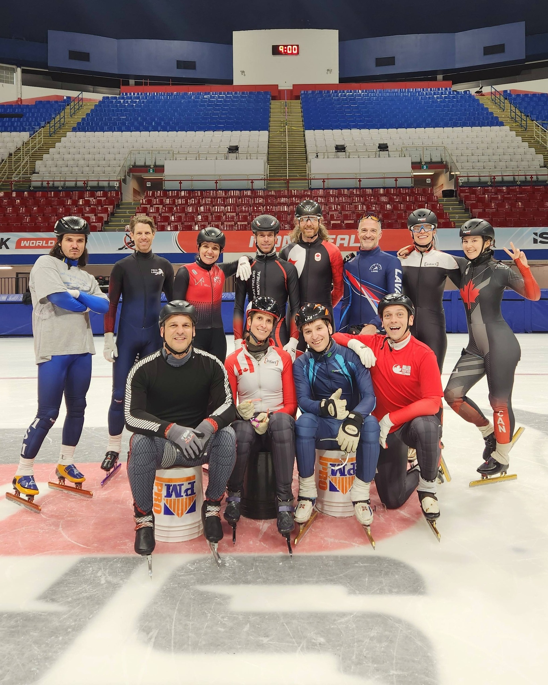

# Le club

Vous recherchez une activité physique qui vous garde en forme dans une atmosphère de camaraderie?

Le Club des maîtres-patineurs de Montréal, membre de [Patinage de vitesse Québec](https://www.patinagedevitessequebec.ca/), offre la possibilité d'entraînements supervisés, pour patineurs débutants à experts.

Nous sommes un groupe qui s'amusent à patiner dans une ambiance décontractée et ludique!

## Historique

Le club des Maîtres-patineurs de Montréal tient son origine de Jean-Luc Malo. Celui-ci venait de co-fonder le Club Montréal Ahuntsic en septembre 1990 - en même temps que Ginette et Robert Bourassa ont fondé le Club Saint-Michel.

Au début de l’année 1991, le Président de la région ouest de la FPVQ et du club de Saint-Jérôme avait demandé à la Ville de Montréal du « temps de glace » pour des adultes qui voulaient essayer de patiner avec de longues lames. Deux heures à l’aréna Michel-Normandin du CSCR ont été allouées le samedi. 

Jean-Luc souhaitait apprendre à patiner avec de longues lames. Ce sont Adélard Blais, le frère de Ginette, Marc-Antoine Nadeau, le frère de Yves Nadeau, alors coach de l’équipe nationale, Martin Stockmaier, celui qui a vraiment développé le courte piste ici, et d’autres qui ont montré aux curieux. C'était alors une activité sportive entre amis, mais ce n’était pas encore un club.

### La fondation du club

La Ville de Montréal à exigé que l’on constitue un club, ce que qui a été fait le 9 août 2004 sous forme de statut d’OBNL. Le club des Maîtres-patineurs de Montréal était né!

Les patineurs étaient nombreux déjà à cette époque: entre 20 et 30 sur une petite glace et de tous les niveaux.

Les entraîneurs se sont succédé: Jocelyn Brûlé puis Youri Juteau et Antoine Malo, fils de Jean-Luc.

### L'époque Maurice-Richard

Le club a ensuite déménagé à [l'aréna Maurice-Richard](/docs/arena-maurice-richard) en 2010, l’année des Jeux olympiques de Vancouver qui a transformé l'aréna pour un système sans bandes. C'est aussi l'année durant laquelle notre [président et entraîneur Bruno](/nouvelles/authors/brunopc) commence à s'impliquer avec le club, tout d'abord avec le groupe de Gadbois où il s'entraînait.

Il a ensuite commencé à entraîner en même temps le groupe de Maurice-Richard en 2011. Plusieurs entraîneurs ont également mis des leurs pour le club: Olivier Godin, Myrka Bergeron, Zoé Candelier, Nicolas Desjardins.

## Des Olympiens parmi nous

À travers les années, nous avons eu la chance d'avoir dans nos patineurs plusieurs patineurs d'exception:

- [**Olivier Jean**](https://olympique.ca/team-canada/olivier-jean/), champion olympique 🥇 et maintenant [entraîneur de l'équipe nationale](https://www.journaldemontreal.com/2026/02/17/olivier-jean--lheureux-instructeur-aux-nombreux-chapeaux-de-lequipe-de-patinage-de-vitesse)
- [**Mathieu Turcotte**](https://olympique.ca/team-canada/mathieu-turcotte/), champion et triple médaillé olympique 🥉🥇🥈, fondateur de [Apex Racing Skates](https://apexracingskates.com/fr/pages/history) et participant de la [finale olympique la plus célèbre](https://www.youtube.com/watch?v=LwWt3jNhsv4)!
- **Laurie Marceau**, médaillée aux Championnats du monde juniors 🥉
- [**François-Louis Tremblay**](https://olympique.ca/team-canada/francois-louis-tremblay/), champion et quintuple médaillé olympique 🥇🥈🥈🥉🥇
