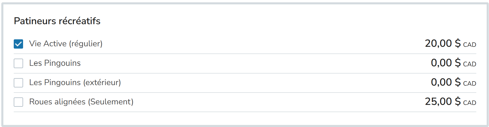
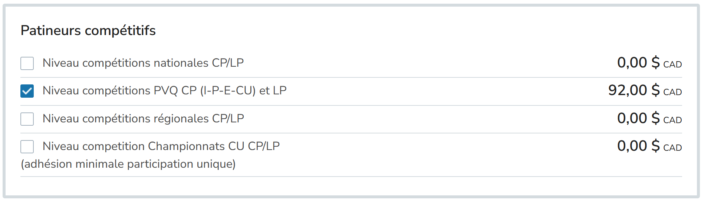
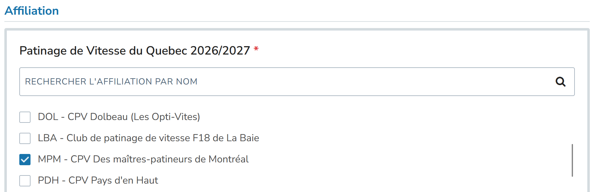

:::warning[Groupe Maurice-Richard seulement]

Depuis la saison 2025-2026, le Club des Maîtres-patineurs ne s’occupe plus que des opérations du groupe Maurice-Richard. Référez-vous au [club de Gadbois](https://www.cpvgadbois.com/patinage-adulte/) et au [club de Saint-Michel](https://www.zeffy.com/fr-CA/ticketing/cpvmsm-2025--2026) pour les groupes de maîtres associés à ces clubs.

:::

## Inscription: les étapes

### 1. Prendre connaissance des modalités

- Prenez connaissance des [termes et conditions](/termes-et-conditions)
- Prenez connaissance des [règlements des séances](/reglements)

:::warning[Admissibilité]

Nos membres doivent être avoir 18 ans et plus et savoir patiner: [les critères d'admission exacts sont expliqués dans la page des règlements](/reglements#niveau-requis). Aucun débutant en patinage de vitesse ne peut commencer dans ce groupe sans une validation préalable par l’entraîneur. Cette validation se fait durant l'essai gratuit du patineur.

Si vous débutez et souhaitez apprendre ce merveilleux sport, des cours pour les débutants sont offerts. Pour en savoir davantage, consultez la section [Je me lance!](/docs/category/je-me-lance).
:::

### 2. Inscription à PVQ (Patinage de vitesse Québec)

Inscrivez-vous à Patinage de vitesse Québec sur IceReg: https://icereg.ca/#!/memberships/builder-v2/patinage-de-vitesse-du-quebec-20262027.

#### Choisir son type d'inscription

##### L'inscription récréative

Si vous n'avez pas l'intention de participer à des compétitions, c'est l'inscription la moins chère qui vous permet d'avoir accès à nos entraînements. L'option à choisir est `Vie active (régulier)`.

Cette option ne vous empêche pas de revenir acheter une licence de compétition plus tard durant la saison.

##### L'inscription compétitive

Pour ceux qui veulent participer à plusieurs compétitions, la licence à choisir est l'option `Niveau compétitions PVQ CP (I-P-E-CU) et LP`. Cette licence vous permettera à la fois de participer aux compétitions provinciales Collégiales-Universitaires (CU), mais également aux [MIST (Masters International Short Track Games)](https://imssc.org/mstr/). 

Si vous voulez essayer une seule compétition en cours de saison, il est toujours possible d'acheter une licence de compétition unique: `Niveau competition Championnats CU CP/LP (adhésion minimale participation unique)`. Cela vous permet de participer à deux compétitions Collégiales-Universitaires avant que la licence annuelle soit un meilleur prix.

#### Choisir son club d'affiliation

Choississez `MPM - CPV Des maîtres-patineurs de Montréal`

### 3. Paiement des heures de glace au Club des Maîtres-patineurs

L'étape suivante est de payer vos heures de glaces: rendez-vous dans la section [Tarifs et paiement](/docs/tarifs-et-paiement).
