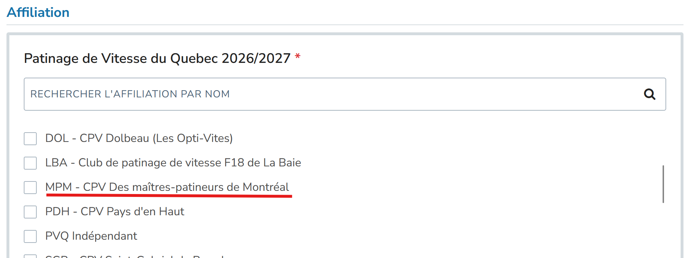

## Tarifs

:::warning

Depuis la saison 2025-2026, le Club des Maîtres-patineurs ne s’occupe plus que des opérations du groupe Maurice-Richard. Référez-vous au [club de Gadbois](https://www.cpvgadbois.com/patinage-adulte/) et au [club de Saint-Michel](https://www.zeffy.com/fr-CA/ticketing/cpvmsm-2025--2026) pour les groupes de maîtres associés à ces clubs.

:::

### Scéances individuelles 

| Tarif              | Détails                                 | Prix  | Coût/scéance |
| -------------------| --------------------------------------- | ----- | ------------ |
| 1 séance           | 1ère gratuite pour un nouveau patineur  | $35   | $35 	      |
| 5 séances*         | Coupons prépayés                        | $150  | $30          |

La première scéance est gratuite pour tout nouveau patineur désirant essayer. Un patineur sera considéré nouveau s'il n'a pas patiné avec nous depuis mars 2025.

*5 séances: les coupons sont utilisables uniquement pour la saison en cours et ne sont pas remboursables. Cette offre n'est pas rétroactive ni transférable à un autre patineur.

### Abonnements, 1x semaine

| Tarif                                    | Prix        | Nombre de scéances | Coût/scéance  |
| ---------------------------------------- | ----------- | ------------------ | ------------- |
| Session d'automne (septembre à décembre) | $315,00     | 14                 | $22,50        |
| Session d'hiver (janvier à mars)         | $270,00     | 12                 | $22,50        |
| Saison complète                          | $552,50     | 26                 | $21,25        |

### Abonnements, 2x semaine

| Tarif                                    | Prix     | Nombre de scéances  | Coût/scéance  |
| ---------------------------------------- | -------- | ------------------- | ------------- |
| Session d'automne (septembre à décembre) | $ 573,75 | 27                  | $21,25        |
| Session d'hiver (janvier à mars)         | $ 510,00 | 24                  | $21,25        |
| Saison complète                          | $1020,00 | 51                  | $20,00        |

## Inscription: les étapes

### 1. Prendre connaissance des modalités

- Prenez connaissance des [termes et conditions](/termes-et-conditions)
- Prenez connaissance des [règlements des séances](/reglements)

:::warning

Ce groupe vise des patineurs de 18 ans et plus qui savent patiner: [les critères d'admission exacts sont expliqués dans la page des règlements](/reglements#niveau-requis). Aucun débutant en patinage de vitesse ne peut commencer dans ce groupe sans une validation préalable par l’entraîneur. Cette validation se fait durant l'essai gratuit du patineur. 

Si vous débutez et souhaitez apprendre ce merveilleux sport, des cours pour les débutants sont offerts. Pour en savoir davantage, consultez la section [Je me lance!](/docs/category/je-me-lance).

:::

### 2. Inscription à PVQ (Patinage de vitesse Québec)

Inscrivez-vous à Patinage de vitesse Québec sur IceReg: https://icereg.ca/#!/memberships/builder-v2/patinage-de-vitesse-du-quebec-20262027.

Choississez `MPM - CPV Des maîtres-patineurs de Montréal`

Remplissez ensuite les différents formulaires: Renseignements sur les membres, préférences linguistique, etc.

**Type d'inscription**
- Pour ceux qui veulent participer à des compétitions: Il faut choisir l'option  `Niveau compétitions PVQ (I-P-E-CU)`.
- Pour participer aux entrainements de manière récréative, vous devez vous inscrire comme patineur ou patineuse `Vie active (régulier)`.

### 3. Paiement au Club des Maîtres-patineurs

Vous devrez choisir un type de paiement

1. Abonnement: le plus simple. Vous payez une fois et tous les entraînements de votre plage horaire sont inclus.
2. Coupons: vous pouvez payer pour 5 séances.
3. La séance individuelle. Le choix par défaut si vous n'avez pas d'abonnement ou de coupons. Vous serez invité à payer sur place avant votre séance (idéalement par interac, sinon comptant).

### 4. Payer

:::info

Bonne nouvelle! Depuis la saison 2025-2026, par souci de simplification d’inscription pour les membres, le paiement interac a été implémenté.

:::

Il suffit ensuite d’envoyer votre argent (transfert interac) à votre [shérif du tiroir-caisse](/nouvelles/authors/sherif-du-tiroir-caisse): tresorier@maitrespatineurs.ca. Autodépôt étant activé, il n'y a pas de question et de mot à passe à configurer. 

:::warning

Comme le montant de votre transfert interract détermine votre type d'abonnement, il est important de bien inscrire le montant

:::

Le tour est joué, au plaisir de vous retrouver parmi nous!
